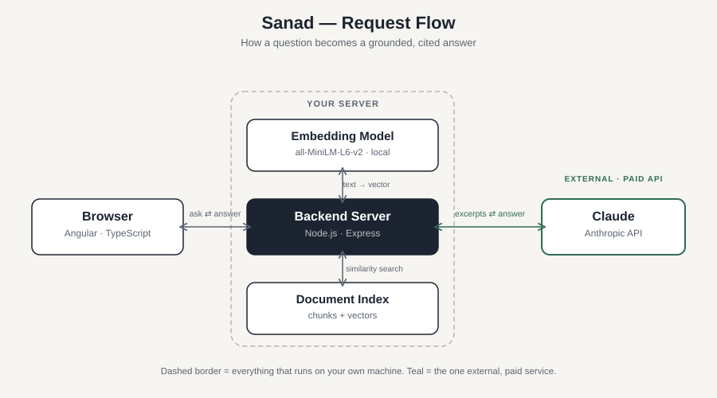
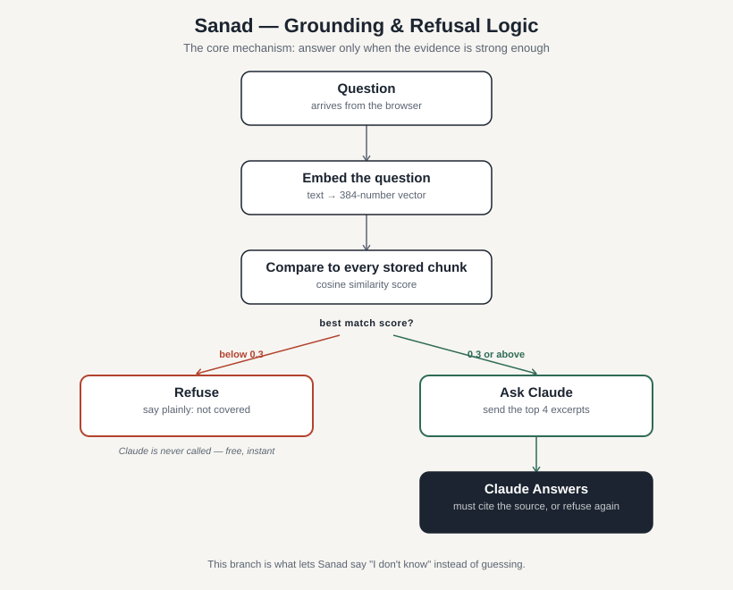

# Sanad (سند)



A bank policy Q&A assistant built on retrieval-augmented generation (RAG). "Sanad" is Arabic for a supporting document — a receipt, a chain of evidence back to a source. That's the whole design: every answer is generated strictly from retrieved document excerpts, cited by document and section. If nothing relevant is retrieved, it says so instead of guessing.

Bilingual (Arabic/English) interface with full RTL layout switching.

## How it works

1. **Chunking** — `chunk.js` splits each document by `##` section headings, then further splits any section longer than 150 words into overlapping windows (30-word overlap) so no fact gets cut across a boundary invisibly. Documents with no headings (plain pasted text, or text extracted from a PDF) fall back to a single section instead of silently producing zero chunks.
2. **Embedding** — `embeddings.js` turns each chunk into a vector using a small local model (`all-MiniLM-L6-v2`, via `@xenova/transformers`). Runs entirely on-machine — no external API key or per-call cost for this step.
3. **Indexing** — `ingestDocument.js` is the shared chunk+embed pipeline for one document, used identically by the CLI script and the live upload endpoint. `indexStore.js` owns reading/writing the index file, with `addOrReplace` swapping one document's chunks without touching the rest.
4. **Retrieval** — on a question, `retrieve.js` embeds the query and ranks every stored chunk by cosine similarity. Only the top 4 above a similarity floor (0.3) are kept; below that, nothing gets passed to Claude at all.
5. **Generation** — `server.js` sends only the retrieved excerpts to Claude, instructed to answer strictly from them, cite which excerpt backed each claim, and say plainly when the excerpts don't cover the question.



## Growing the index live

Beyond the 4 starter policy documents, the index grows two ways, both without a restart:

- **Paste text** — `POST /api/documents` (title + content)
- **Upload a PDF** — `POST /api/documents/upload`, parsed with `parsePdf.js` (via `pdf-parse`), then the same chunk/embed/index pipeline. Scanned/image-only PDFs aren't supported — that needs OCR, which isn't built here.

The frontend's "+ Add document" panel exposes both. This is what makes it a platform rather than a fixed demo: the searchable set grows without touching code.

## Setup

```
cd backend
npm install
npm run ingest        # builds the index from the 4 starter documents — first run downloads the embedding model (~90MB)
cp .env.example .env  # add your ANTHROPIC_API_KEY
npm start
```

Backend runs on `http://localhost:8788`.

```
cd frontend-app
npm install
ng serve
```

Frontend runs on `http://localhost:4200`.

## Known limitations

- **English-only retrieval.** The embedding model (`all-MiniLM-L6-v2`) is English-only, so while the interface itself is fully bilingual, an Arabic-language question against these English documents won't retrieve reliably yet. A multilingual embedding model is a direct swap in `embeddings.js` if the document set needs to support that.
- **No auth or access control.** Anyone who can reach the API can ask anything or add any document. Fine for a local demo, not for a real deployment.
- **No scanned-document support.** PDF upload extracts real text; it can't OCR a scanned image.
- **Single-file index.** `retrieve.js` does a linear scan over the stored chunks — genuinely fine at this scale (dozens of chunks), would need a real vector database at a much larger one.

## Extending

- Tune retrieval: `TOP_K` and `MIN_SIMILARITY` in `retrieve.js`.
- Tune chunking: `chunkSize` / `overlap` in `chunk.js`.
- Swap in a multilingual embedding model to make Arabic-language retrieval work end to end, not just the UI.
